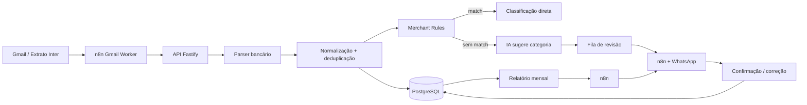

<div align="center">

# Copiloto

### Automação pessoal para importar, classificar e acompanhar transações financeiras

Backend em **TypeScript + Fastify + PostgreSQL**, com **n8n** como camada de automação e revisão de classificações pelo **WhatsApp**.

</div>

---

## Visão geral

O **Copiloto** começou como um projeto de estudo para eu entender melhor APIs, backend e integrações usando um problema que eu realmente tinha: organizar minhas próprias transações financeiras sem depender de lançamento manual o tempo todo, fora que eu via que como futuramente eu iria precisar de algo do tipo , pensei: poxa eu estudo tecnologia por que não fazer meu próprio sistema??

A primeira ideia era receber movimentações bancárias de forma totalmente automática por APIs/webhooks. Na prática, esse caminho esbarrou nas limitações de acesso para pessoa física e no custo das alternativas que encontrei. Em vez de abandonar a ideia, o projeto mudou de arquitetura: hoje o **n8n busca os extratos recebidos por e-mail**, envia o CSV para o backend e o restante do processamento acontece a partir dali.

A V2 fecha esse ciclo com importação de extrato, normalização, deduplicação, classificação por regras + IA, revisão humana pelo WhatsApp e relatório mensal.

> Este é um projeto pessoal em uso e evolução, não um produto/SaaS pronto para uso genérico

## Como funciona hoje



### O que está implementado

- **Importação de extratos bancários** por arquivo, com suporte atual ao CSV do Banco Inter.
- **Registry de parsers**, separando o formato de cada banco do restante da aplicação.
- **Normalização e deduplicação** de transações usando origem, hash do arquivo e fingerprints de conteúdo.
- **Classificação em camadas**: regras de comerciante primeiro; sem regra compatível, a IA sugere uma categoria para revisão.
- **Human-in-the-loop pelo WhatsApp**: a sugestão pode ser aceita, alterada e opcionalmente transformada em uma nova Merchant Rule.
- **Relatório mensal** com receitas, despesas, saldo, categorias e maiores gastos.
- **Automações no n8n** para ingestão por e-mail, fila de revisão e envio do relatório.
- Validação com **Zod**, tratamento padronizado de erros e testes automatizados para os principais fluxos do backend.

## Evolução do projeto

### V1 — fundamentos do backend

A primeira versão foi focada em aprender e estruturar o backend: CRUD de transações, categorias e contas, relatório mensal, classificação e uma primeira rota genérica de importação CSV com preview, validação e tratamento de duplicatas.

Nesse momento, a ideia ainda era chegar a uma ingestão bancária praticamente em tempo real.

### V2 — o fluxo que eu realmente consigo usar

A principal mudança foi aceitar uma restrição do projeto: **a integração bancária automática que eu imaginava não era viável para o contexto atual**.

A solução passou a usar o e-mail como ponto de entrada:

1. o banco envia o extrato;
2. o n8n encontra a mensagem e baixa o anexo;
3. o backend identifica o formato e processa o CSV;
4. as transações são normalizadas, deduplicadas e persistidas;
5. regras conhecidas classificam automaticamente;
6. casos restantes recebem uma sugestão da IA e entram na fila de revisão;
7. a decisão humana volta pelo WhatsApp;
8. o relatório mensal usa os dados já consolidados.

Essa mudança acabou sendo uma das partes mais importantes do projeto: menos “automação perfeita no papel” e mais uma arquitetura que eu consigo manter e usar de verdade.

## Arquitetura e stack

| Camada | Tecnologias / papel |
| --- | --- |
| Backend | TypeScript, Node.js, Fastify |
| Validação | Zod |
| Persistência | PostgreSQL, Prisma |
| Automação | n8n |
| IA | OpenAI API com resposta estruturada e validação de contrato |
| Mensageria / interface operacional | WhatsApp via Evolution API |
| Infraestrutura | Docker + VPS |
| Testes | Testes de parser, importação, classificação, autenticação e relatórios |

A organização do backend separa responsabilidades entre domínio, persistência, serviços, HTTP e integrações externas:

```text
src/
├── core/               # regras e contratos do domínio
├── data/               # repositories / persistência
├── services/           # casos de uso
├── integrations/       # bancos e IA
├── http/               # rotas, schemas e tratamento de erros
├── config/             # configuração da aplicação
└── tests/              # testes dos principais fluxos

n8n/                    # workflows exportados e sanitizados
docs/                   # documentação técnica complementar
prisma/                 # schema e migrations
deploy/                 # arquivos de deployment
```

## Algumas decisões de engenharia

### Importação idempotente

Reprocessar o mesmo extrato não deveria criar cópias das mesmas transações. Por isso a importação mantém identidade tanto no nível do **lote** quanto das **transações**, combinando dados como origem, conta, provider, hash do arquivo e fingerprint do movimento.

### Schema Prisma isolado

O `schema.prisma` contém somente os models usados pelo Copiloto Financeiro. A infraestrutura de produção pode compartilhar uma instância PostgreSQL com outros serviços, mas tabelas externas não fazem parte do contrato nem da documentação pública deste projeto.

### Parser por instituição

O formato externo não vaza para o restante da aplicação. Cada banco pode ter seu próprio parser, responsável apenas por transformar o arquivo recebido em um contrato interno comum. Hoje o registry possui o `INTER_CSV`; novos formatos podem ser adicionados sem reescrever todo o fluxo de importação.

### Regra antes de IA

Antes de chamar o modelo, o backend tenta encontrar uma Merchant Rule compatível com contexto da conta, direção/operação e descrição. Quando não existe regra, a IA recebe apenas as categorias permitidas e devolve uma sugestão estruturada. A sugestão **não é aplicada silenciosamente**: ela fica pendente de revisão.

## Processos (BPMN)

Os diagramas abaixo documentam o processo atual (**AS-IS**) e uma evolução futura da classificação (**TO-BE**).

<details>
<summary><strong>Importação de extrato por e-mail — AS-IS</strong></summary>
<br>


</details>

<details>
<summary><strong>Classificação e revisão — AS-IS</strong></summary>
<br>


</details>

<details>
<summary><strong>Relatório mensal — AS-IS</strong></summary>
<br>


</details>

<details>
<summary><strong>Classificação — TO-BE / proposta futura</strong></summary>
<br>

> Este fluxo é uma proposta de evolução e **não representa funcionalidades já implementadas**.


</details>

## Workflows do n8n

Os exports publicados em [`n8n/`](./n8n/) são versões sanitizadas: não incluem credenciais, IDs de webhook, ID da instância nem dados fixos do WhatsApp. Eles documentam a automação, mas ainda possuem decisões/configurações específicas do projeto e não devem ser tratados como workflows plug-and-play. Depois de importar um fluxo, é necessário selecionar as próprias credenciais e preencher os placeholders.

<details>
<summary><strong>Gmail Worker — captura e envio de extratos</strong></summary>
<br>


</details>

<details>
<summary><strong>Revisão de classificações</strong></summary>
<br>


</details>

<details>
<summary><strong>Relatório mensal</strong></summary>
<br>


</details>

## Documentação técnica

Alguns fluxos têm documentação mais detalhada fora deste README para evitar transformar a página inicial em uma muralha de texto:

- [`src/docs/imports-csv.md`](./src/docs/imports-csv.md) — importação CSV da primeira versão.
- [`src/docs/monthly-report.md`](./src/docs/monthly-report.md) — comportamento do relatório mensal.
- [`CLASSIFICATION_REVIEWS_N8N.md`](./CLASSIFICATION_REVIEWS_N8N.md) — integração da fila de revisão com o n8n.

## Limitações atuais

- O parser bancário da V2 suporta atualmente apenas o **Banco Inter (`INTER_CSV`)**.
- A configuração dos workflows ainda é bastante ligada ao meu ambiente pessoal.
- Não existe frontend de configuração/uso; a interface operacional atual é composta pelas automações e pelo WhatsApp.
- O projeto ainda não possui onboarding para múltiplos usuários como produto.
- A parte de investimentos ainda não é o foco do fluxo atual.

## Próximas versões

A V2 está encerrada e o projeto entra em uma pausa antes da próxima rodada de desenvolvimento. As próximas versões devem explorar, entre outras coisas:

- suporte a novos formatos/instituições bancárias;
- evolução da classificação e criação de regras;
- tratamento mais completo de investimentos;
- redução de configurações hardcoded nos workflows;
- experiência de configuração mais amigável;
- frontend e uma estrutura realmente utilizável por outras pessoas.

## Sobre o desenvolvimento

Este projeto nasceu principalmente como **projeto de aprendizado**. Eu comecei querendo entender melhor APIs e backend e, conforme o escopo cresceu, acabei estudando TypeScript, persistência, integrações, parsing de arquivos, automação e decisões de arquitetura na prática.

Também usei **IA de forma intensa como ferramenta de desenvolvimento**, principalmente para implementação, debugging e para explorar alternativas em partes que estavam acima do meu nível técnico no momento. Eu defini o problema, os fluxos e as regras que queria resolver, implementei partes do sistema, testei e fui estudando o código produzido durante as iterações.

A parte de **Docker/VPS/deployment**, em especial, teve assistência pesada de IA e não é uma área que eu considere dominar hoje. Preferi deixar isso explícito: a intenção deste repositório é mostrar o que construí e aprendi no processo, não vender uma proficiência que eu ainda não tenho.

---

<div align="center">

**Status:** V2 concluída · desenvolvimento em pausa antes da V3

</div>
